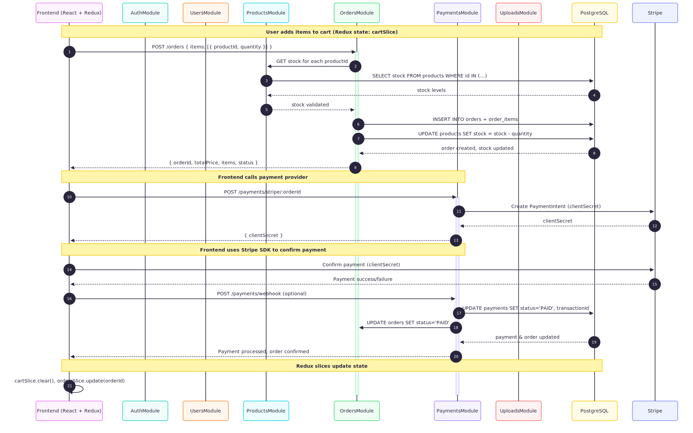

# 🎸 Guitar Store – Backend Checklist + API Contract

---

## 0️⃣ Auth Module (`src/auth`)

| Method | Path           | Auth | Request Body                                        | Response Body                                               | Notes                 |
| ------ | -------------- | ---- | --------------------------------------------------- | ----------------------------------------------------------- | --------------------- |
| POST   | /auth/register | No   | `{ name: string, email: string, password: string }` | `{ accessToken: string, refreshToken: string }`             | Register user         |
| POST   | /auth/login    | No   | `{ email: string, password: string }`               | `{ accessToken: string, refreshToken: string }`             | Login user            |
| POST   | /auth/refresh  | No   | `{ refreshToken: string }`                          | `{ accessToken: string, refreshToken: string }`             | Refresh JWT           |
| GET    | /auth/me       | Yes  | –                                                   | `{ id: string, name: string, email: string, role: string }` | Get current user info |

**Checklist Files / Tasks**:

* `auth.module.ts`, `auth.service.ts`, `auth.controller.ts`, `auth.guard.ts`
* Implement JWT access + refresh
* Hash password (bcrypt)
* AuthGuard + RolesGuard
* Unit tests: `auth.service.spec.ts`, `auth.controller.spec.ts`

---

## 1️⃣ Users Module (`src/users`)

| Method | Path        | Auth/Role  | Request Body                   | Response Body         | Notes            |
| ------ | ----------- | ---------- | ------------------------------ | --------------------- | ---------------- |
| GET    | /users      | Admin      | –                              | `User[]`              | List all users   |
| GET    | /users/\:id | Yes        | –                              | `User`                | Get user by ID   |
| PUT    | /users/\:id | Admin/self | `{ name?, email?, password? }` | `User`                | Update user info |
| DELETE | /users/\:id | Admin      | –                              | `{ message: string }` | Delete user      |

**Checklist Files / Tasks**:

* `users.module.ts`, `users.service.ts`, `users.controller.ts`
* CRUD methods, role-based guards
* DTOs for update & response
* Unit tests: `users.service.spec.ts`

**User object**:

```ts
{
  id: string;
  name: string;
  email: string;
  role: 'USER' | 'ADMIN';
  createdAt: string;
}
```

---

## 2️⃣ Products Module (`src/products`) – **tạo mới**

| Method | Path           | Auth/Role | Request Body       | Response Body         | Notes                                                                                 |
| ------ | -------------- | --------- | ------------------ | --------------------- | ------------------------------------------------------------------------------------- |
| GET    | /products      | No        | –                  | `Product[]`           | List all products, support query: `categoryId`, `brand`, `min`, `max`, `take`, `skip` |
| GET    | /products/\:id | No        | –                  | `Product`             | Get product detail                                                                    |
| POST   | /products      | Admin     | `ProductCreateDto` | `Product`             | Create product                                                                        |
| PUT    | /products/\:id | Admin     | `ProductUpdateDto` | `Product`             | Update product                                                                        |
| DELETE | /products/\:id | Admin     | –                  | `{ message: string }` | Delete product                                                                        |

**Product object**:

```ts
{
  id: string;
  name: string;
  description?: string;
  price: number;
  stock: number;
  brand: string;
  images: string[];
  categoryId: string;
  createdAt: string;
}
```

**Checklist Files / Tasks**:

* `products.module.ts`, `products.service.ts`, `products.controller.ts`
* DTOs: `ProductCreateDto`, `ProductUpdateDto`
* Filtering + pagination support
* Admin guard
* Unit tests

---

## 3️⃣ Categories Module (`src/categories`) – **tạo mới**

| Method | Path             | Auth/Role | Request Body                             | Response Body         | Notes           |
| ------ | ---------------- | --------- | ---------------------------------------- | --------------------- | --------------- |
| GET    | /categories      | No        | –                                        | `Category[]`          | List categories |
| POST   | /categories      | Admin     | `{ name: string, description?: string }` | `Category`            | Create category |
| PUT    | /categories/\:id | Admin     | `{ name?, description? }`                | `Category`            | Update category |
| DELETE | /categories/\:id | Admin     | –                                        | `{ message: string }` | Delete category |

**Category object**:

```ts
{
  id: string;
  name: string;
  description?: string;
}
```

**Checklist Files / Tasks**:

* `categories.module.ts`, `categories.service.ts`, `categories.controller.ts`
* CRUD methods, Admin guard
* DTOs + validation
* Unit tests

---

## 4️⃣ Orders Module (`src/orders`) – **tạo mới**

| Method | Path         | Auth/Role                | Request Body                                           | Response Body         | Notes                      |
| ------ | ------------ | ------------------------ | ------------------------------------------------------ | --------------------- | -------------------------- |
| POST   | /orders      | Yes                      | `{ items: { productId: string, quantity: number }[] }` | `Order`               | Create order, reduce stock |
| GET    | /orders      | Yes (user) / Admin (all) | –                                                      | `Order[]`             | List orders                |
| GET    | /orders/\:id | Yes                      | –                                                      | `Order`               | Order detail               |
| PUT    | /orders/\:id | Admin                    | `{ status?: OrderStatus }`                             | `Order`               | Update status              |
| DELETE | /orders/\:id | Admin                    | –                                                      | `{ message: string }` | Cancel order               |

**Order object**:

```ts
{
  id: string;
  userId: string;
  totalPrice: number;
  status: 'PENDING' | 'PAID' | 'SHIPPED' | 'DELIVERED' | 'CANCELED';
  items: { productId: string, quantity: number, price: number }[];
  createdAt: string;
  payment?: Payment;
}
```

**Checklist Files / Tasks**:

* `orders.module.ts`, `orders.service.ts`, `orders.controller.ts`
* DB transaction: create order + reduce stock
* Admin/user role guard
* DTOs for create/update
* Unit tests

---

## 5️⃣ Payments Module (`src/payments`) – **tạo mới**

| Method | Path                       | Auth/Role | Request Body | Response Body              | Notes                        |
| ------ | -------------------------- | --------- | ------------ | -------------------------- | ---------------------------- |
| POST   | /payments/stripe/\:orderId | Yes       | –            | `{ clientSecret: string }` | Stripe PaymentIntent         |
| POST   | /payments/paypal/\:orderId | Yes       | –            | `{ approveUrl: string }`   | Optional, PayPal integration |

**Payment object**:

```ts
{
  id: string;
  orderId: string;
  provider: 'STRIPE' | 'PAYPAL';
  status: string;
  transactionId?: string;
  createdAt: string;
}
```

**Checklist Files / Tasks**:

* `payments.module.ts`, `payments.service.ts`, `payments.controller.ts`
* Stripe & PayPal integration
* Save payment info → DB
* Admin/user validation
* Unit tests

---

## 6️⃣ Uploads Module (`src/uploads`) – **tạo mới**

| Method | Path     | Auth/Role | Request Body                   | Response Body       | Notes                               |
| ------ | -------- | --------- | ------------------------------ | ------------------- | ----------------------------------- |
| POST   | /uploads | Yes       | `multipart/form-data` files\[] | `{ url: string }[]` | Upload multiple images, return URLs |

**Checklist Files / Tasks**:

* `uploads.module.ts`, `uploads.service.ts`, `uploads.controller.ts`
* Save files locally / S3 / cloud
* Validate file type/size
* Return array of URLs
* Unit tests

---

## 7️⃣ Common / Global Tasks

* JWT + refresh token auth globally
* Admin/user guards for all protected endpoints
* ValidationPipe + DTOs
* Error handling (NestJS exception filters)
* Logging middleware
* Swagger documentation (optional)
* Unit & integration tests for all modules
* DB seed scripts for testing


# 🎸 Guitar Store – Checkout + Payment + Stock Update Flow

```
User (Frontend)
 ├─ cartSlice (items)
 └─ checkoutButton()
       |
       v
1. POST /orders
──────────────────────────────────────────────
Request Body:
{
  "items": [
    { "productId": "p1", "quantity": 2 },
    { "productId": "p2", "quantity": 1 }
  ]
}
──────────────────────────────────────────────
Backend: OrdersController.create(dto)
  - Validate JWT & AuthGuard
  - Validate stock for each product
  - Begin transaction:
      - Create order in `orders` table
      - Create order_items in `order_items` table
      - Reduce stock in `products` table
  - Commit transaction
──────────────────────────────────────────────
Response Body:
{
  "id": "order123",
  "userId": "user456",
  "totalPrice": 350,
  "status": "PENDING",
  "items": [
    { "productId": "p1", "quantity": 2, "price": 100 },
    { "productId": "p2", "quantity": 1, "price": 150 }
  ],
  "createdAt": "2025-09-05T00:00:00.000Z"
}
       |
       v
2. POST /payments/stripe/:orderId  (or PayPal)
──────────────────────────────────────────────
Request Body: none
──────────────────────────────────────────────
Backend: PaymentsController.createStripePayment(orderId)
  - Validate JWT & AuthGuard
  - Fetch order details
  - Create Stripe PaymentIntent:
      - amount = order.totalPrice
      - currency = USD
  - Save payment record in `payments` table:
      - status: "PENDING"
      - provider: "STRIPE"
──────────────────────────────────────────────
Response Body:
{
  "clientSecret": "pi_123456_secret_abcdef"
}
       |
       v
3. Frontend: Stripe SDK
──────────────────────────────────────────────
stripe.confirmCardPayment(clientSecret, { payment_method: card })
  - User completes payment
──────────────────────────────────────────────
4. Stripe Webhook (Backend)
──────────────────────────────────────────────
POST /webhook/stripe
  - event: payment_intent.succeeded
──────────────────────────────────────────────
Backend: PaymentsService.handleWebhook(event)
  - Update `payments.status` = "PAID"
  - Update `orders.status` = "PAID"
──────────────────────────────────────────────
Response: 200 OK
       |
       v
5. Frontend: Poll order status
──────────────────────────────────────────────
GET /orders/:orderId
──────────────────────────────────────────────
Backend: OrdersController.findOne(id)
  - Return updated order:
{
  "id": "order123",
  "status": "PAID",
  "items": [...],
  "totalPrice": 350,
  "createdAt": "2025-09-05T00:00:00.000Z",
  "payment": {
    "id": "pay789",
    "provider": "STRIPE",
    "status": "PAID",
    "transactionId": "txn_abc123",
    "createdAt": "2025-09-05T00:05:00.000Z"
  }
}
──────────────────────────────────────────────
Frontend: update Redux slices (cartSlice.clear(), orderSlice.add(order))
```

---

## 🔹 Notes for Backend Implementation

1. **Transaction Safety**:

   * Order creation + stock reduction must be atomic (use DB transaction).
   * Prevent overselling.

2. **Role Check**:

   * Only authenticated users can create orders or payment.

3. **Payment Integration**:

   * Stripe / PayPal endpoints only return clientSecret / approveUrl.
   * Frontend handles actual payment confirmation.

4. **Webhook Handling**:

   * Update payment and order status on successful payment.
   * Optional: send email confirmation / notifications.

5. **Frontend Redux Slices**:

   * `cartSlice`: clear cart after successful order creation.
   * `orderSlice`: store order details and payment info.


```
Frontend (React + Redux)                          Backend (NestJS Modules)                       Database (PostgreSQL)
-----------------------                           -----------------------                       -------------------

User clicks "Checkout"                             OrdersModule
cartSlice.items ────────────────────────────────► createOrder(dto) ─────────────────────────────► orders
                                                        │                                     create order record
                                                        │
                                                        │                                     order_items
                                                        │                                     insert items
                                                        │
                                                        │                                     products
                                                        │                                     reduce stock
                                                        │
                                                        ▼
                                               Response: Order object
Frontend receives orderId ◄───────────────────────────────┘

Frontend calls Stripe payment                       PaymentsModule
POST /payments/stripe/:orderId ─────────────────────────► createStripePayment(orderId)
                                                        │
                                                        │  Fetch order details
                                                        │
                                                        │  Create PaymentIntent (Stripe SDK)
                                                        │
                                                        ▼
                                               payments table
                                               insert payment record (status: PENDING)
                                                        │
                                                        ▼
Frontend receives clientSecret ◄─────────────────────────┘

User completes payment in Stripe SDK
Frontend sends confirmation automatically

Stripe Webhook triggers                              PaymentsModule
POST /webhook/stripe ───────────────────────────────► handleWebhook(event)
                                                        │
                                                        │  Update payments.status = "PAID"
                                                        │  Update orders.status = "PAID"
                                                        │
                                                        ▼
                                               payments table (update)
                                               orders table (update)

Frontend polls order status                         OrdersModule
GET /orders/:orderId ─────────────────────────────► findOne(orderId)
                                                        │
                                                        │  Return updated order with payment info
                                                        ▼
Frontend updates Redux state:
  - cartSlice.clear()
  - orderSlice.add(order)
```

---

### 🔹 Key Notes for Backend Developer

1. **Modules involved**:

   * **OrdersModule** → `orders` & `order_items` table
   * **PaymentsModule** → `payments` table + Stripe/PayPal integration

2. **DB Transactions**:

   * Order creation + stock update must be **atomic**.
   * Prevent race conditions / overselling.

3. **Frontend Redux Hooks**:

   * `cartSlice` → holds items, clears after successful order
   * `orderSlice` → stores order details + payment info

4. **Error Handling**:

   * 400 for insufficient stock
   * 401 for unauthorized
   * Payment failures handled via webhook


### Payment Flow


https://mermaid.live/edit#pako:eNqVVWtv2jAU_SuWP6ygBsr7EamV2hI2tLYwQjVpY5rc5AJRk5jaDmuH-O-zYwcCFG3jS-zknnPvPffYrLFHfcA25vCSQOxBLyBzRqJpjOSPJILGSfQETO-XhInAC5YkFqjvIMJRn9FYQOyjwhiIJ9A5GoOfvBaP468TsVAI9bynfhLCccwjB8ZVULo4FTVi8oMn0sBsfSp2yHxDqVcnOclbBLHhNOuTVS5DSnxdp16eiuzdpHyUizkD98vdNNYxD1QAoitgUkVLRtlpw4j4kjUQEHEkKPIkkZJVyom4IALs9JUbBh4UM6a-U7q60q3ZaDR0J-iC6pbXmslG39doqVUa-BZ6SWRhgXhDmx9oY6bsiWAl-Y1E-qVeS_JMYRt9dCayEOo9oxllSI57sSPWoCxWwlRTrnPn3GaY_nh4n8Vz9PWTM3ZQ4KPBAyqUy2VjmN5NaS-lhoawgpAfpMj1raNWJAx82YZ_0ICqZPDgOuOJfEyGyOhzrhc_U5XegTyOetcTZ1exu-3-0jxLWzHzxWdFpezIY6BKsgwkWR5XKDF9x5bzShFqRoIKEo6YnLOlh2ilBki4mth7Dsoca-_Oo0fCkEszph9UF6vAV8c4Z5sdShvHBPMLLliwhAvbFHTgkgxm5mF2ks9NYTa6TXvOvgxUPdLIXhjIpwtSEWGmrQGlvVLyYQcZtkLlY_5DkoQDNzmR2_ucnjEazwIWZTrlxNk2sx_xlz5UfSYz4onnAecXMxKECYN_k_4XPC0ofUYFuhQBjUlYPJI5b87s1tLmVBa5PBtdD3pn0kSMxFwNjcbb47kjyVxqiMyZOKLZO5XbmjMtPhiT77n6cFyjnQWVHOosmKOhlVW4U7eiufzUjcdNFn0V5qRUObb3YtkLgbBC0eTg-qVGFoydjaI-vHvv5V7vjI4tPGeBj23BErBwBCwiaovXCjTFYgERTLEtlz5hz1M8jTcSI_8DvlEaZTBGk_kC2zMScrnTRZm_222I9CmwW5rEAtvVVkqB7TV-lbtmt1xrV7rtTrXRbjSblaaF37BdqlbLrVatUal3Wt1Ks93sNDYW_p2mrZQ7lUat3qrUuvVGrVarb_4ApIam2w


✅ **Giải thích sơ đồ**:

1. **Frontend (React + Redux)**:

   * `cartSlice` giữ các sản phẩm user chọn.
   * `ordersSlice` và `paymentsSlice` theo dõi trạng thái checkout và payment.
2. **Backend Modules**:

   * `OrdersModule`: nhận request tạo order, validate stock, lưu order.
   * `ProductsModule`: kiểm tra stock trước khi tạo order.
   * `PaymentsModule`: tạo PaymentIntent Stripe/PayPal, cập nhật payment status.
   * `UploadsModule`: không liên quan trực tiếp checkout, nhưng quản lý image upload.
   * `AuthModule` & `UsersModule`: xác thực JWT, role-based access.
3. **DB (PostgreSQL)**:

   * Tables: `users`, `products`, `orders`, `order_items`, `payments`.
   * Stock giảm trực tiếp khi tạo order.
   * Payment success cập nhật `payments` và `orders` table.


----------------------------------------------------------------
### Mermaid Chart


https://mermaid.live/edit#pako:eNqVVltv4jgU_iuRpZmn0p0WKIWHkQqEFbOdKUuCVtqwsjyJgahJzNhOp52m_32OL7nRtNLmIfGxv3O_OM8oZBFFE7RL2M_wQLh0_Pk2c-D58MHp9XrOgrNM0ixShDkQ-fc9J8eDs3CD8hQvXLymJJTwjvLH_wxSPTOQGYTw8pI4pDiWNBWN4zseUS48SSQNmFlrnFk3gDe5PBgYUSsNygXlOM52DH_5x7dYMGabtTyYkvBeOfCVRXlCRYcjUzewIPyNCvnFO9EbqJdhxwnbxxnmdB8LCdo53XEqDjilDZ4N2CUC_bZcs_Vmrs1turTicBhKEZSLJvho97CQLLzH4YGG96_iFpiP5Qs5hfiY0OEE7MP5MVI7AuKWtzSTp5RmSrNdWAme5PGRYthdkaTp0DFhJAKXzNeij0yr0FsQCJnzDG_Wt-LNTMynjk--d-dgPg1WIG_Pqff3LZ5PT8OpGQMdQhxHOCMpxTQlcYI5q3yPbmRHfA1rFdCS-8hVDdnwAvOe8adl9CrGhtvUo-JVJiwjLJkkycqKUOHtNEGLWKqaNxJM_ZsUgRBrE6x-5CSTsXwyVnWkyjphKWVIQ8hDrGRbO-Rjy4uZcS2mIii9rEIQURFCxmXMsjeTVg-Az1UrremPHBqlkUfV5r3e52J15_m4DJbytTBRNCizVrg_Xb-zxIsyaYahpBSL5966M9-CF-u7r5WAopXpNqfeUuy2QA17Qh9oIk6U1dYtv3nu2ofRIlnpDMlsxFtuNRTW3JvV_MZ3a_c811rdZWfNZg20SmCqFY3heJIUWxXOAsZ2nYQGvspFVTHC9LatmqKsKxstS-k4G6CdJvZkqWpAFq1qbLOeBjpMYtj2KMiRbU86TLU6vflfOGTZLuZpafg7htrpVnlYpUjYVvg_5hphUSnNCHonA-pKcD6a2VRnoLqllGRFQOP9Iqq_8JQSDomFm0of1HgFfSBJrJ1Rx_W8MyBNK5S-GNiRci1RtIDt8rB15vzRaP_aymZXqUbUhbLa-HgOLea7XWVqJ39VVh1j_70ufNXyMD9gDpUDqaitLMdJSTcrqtpsNG7Lb_3z4Qj1cyAck1HxZnvY8mlUDC0WbnuchQlkDavfF0x26r7XQ4rlskK2Mm5FVv8lGoXO0J7HEZpIntMzlFIO1xaQ6FlJ2CJ5oCndogksI8Lvt2ibvQDPkWT_MpaWbJzl-wOa7EgigDKK5jGByzOtdjnMZspnLM8kmlyMR1oImjyjRzTpDfqD8_HVqD_uX11c9z-NL_pn6AlNxsPzwaD_aTi8Hl0OL4dX_Zcz9EvrvTgfDC_74-vR9SUcjUfDl9_RcY7_

✅ **Giải thích sơ đồ**:

1. **Frontend Redux slices**:

   * `cartSlice`: lưu tạm items user chọn.
   * `ordersSlice`: lưu trạng thái orders, orderId, payment.
   * `authSlice`: JWT và user info.

2. **Backend modules**:

   * **AuthModule**: đăng ký, đăng nhập, refresh token, get current user.
   * **UsersModule**: CRUD người dùng, chỉ admin.
   * **ProductsModule**: quản lý sản phẩm, check stock.
   * **OrdersModule**: tạo order, giảm stock, trả về order info.
   * **PaymentsModule**: Stripe/PayPal tạo PaymentIntent, confirm payment, update status.
   * **UploadsModule**: upload hình, trả về URLs.

3. **DB tables**: `users`, `products`, `orders`, `order_items`, `payments`, `categories`.

4. **Luồng dữ liệu Checkout → Payment → Stock Update**:

   * Frontend gửi POST `/orders` → Backend OrdersModule → check stock → giảm stock → trả về order info → Frontend cập nhật Redux.
   * Frontend gọi Payment module → tạo PaymentIntent → Frontend confirm → Payment status cập nhật DB và Redux.
